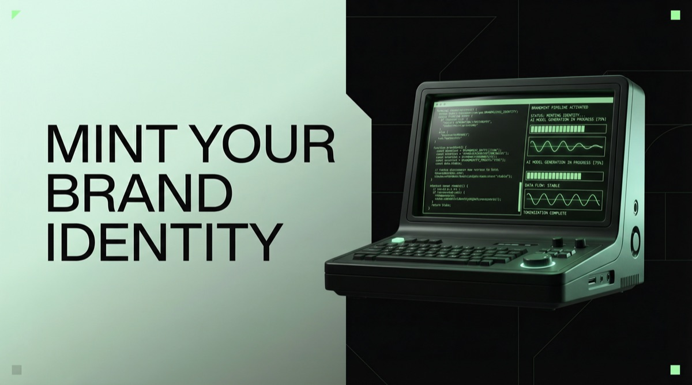
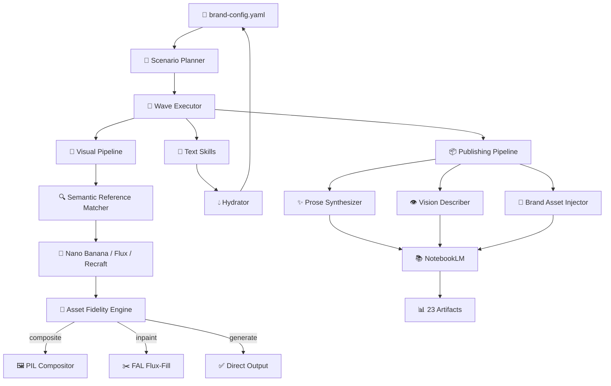
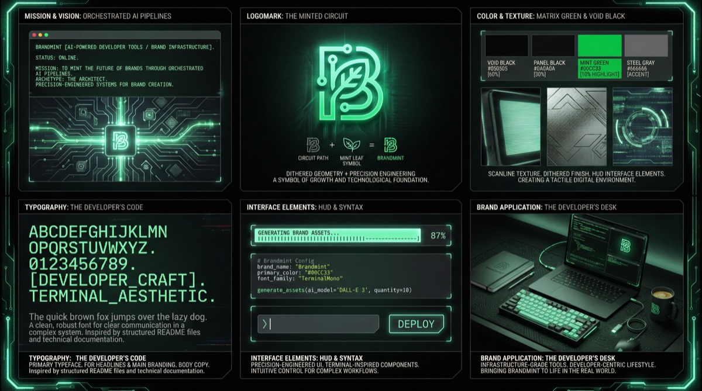
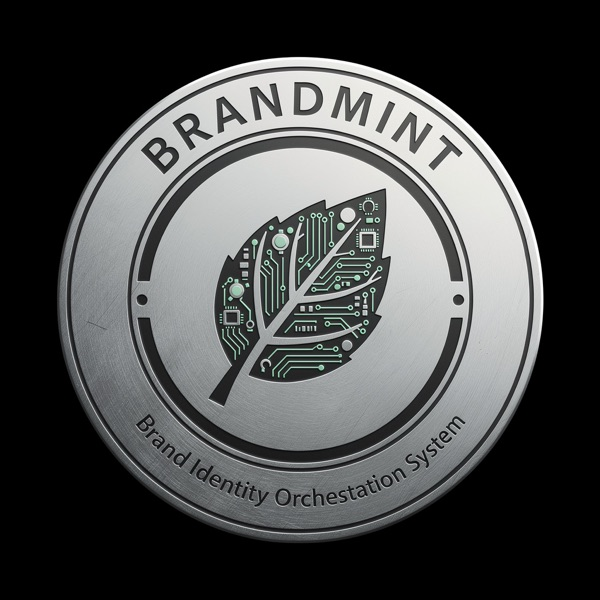
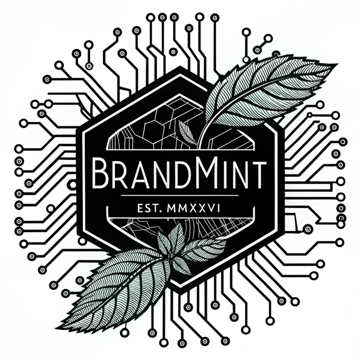
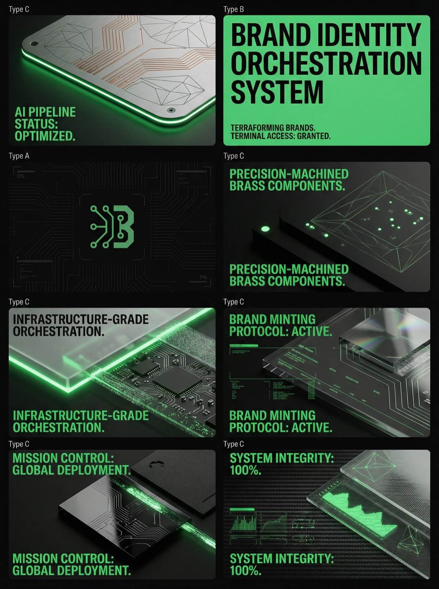
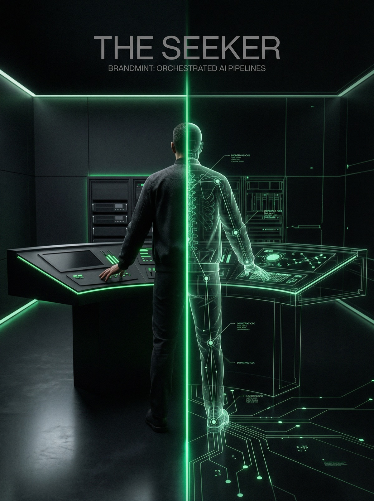
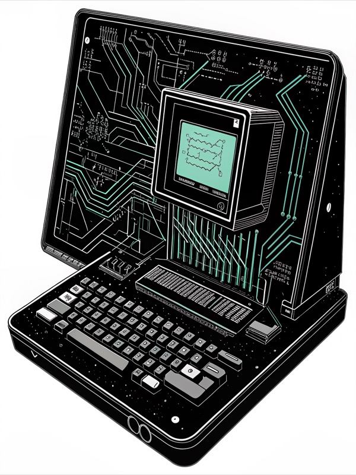

<div align="center">


</div>

<!-- readme-gen:start:badges -->
<p align="center">
  <a href="https://pypi.org/project/brandmint/"></a>
  <a href="./pyproject.toml"></a>
  <a href="https://github.com/Sheshiyer/brandmint-oracle-aleph/releases/latest"></a>
  <a href="./.github/RELEASE_NOTES.md"></a>
  <a href="https://brandmint-openclaw.vercel.app"></a>
  <a href="https://github.com/Sheshiyer/brandmint-oracle-aleph/pkgs/container/brandmint"></a>
  <a href="./ui/"></a>
</p>
<!-- readme-gen:end:badges -->

<!-- readme-gen:start:tech-stack -->
<p align="center">
  
</p>
<!-- readme-gen:end:tech-stack -->

> Build complete brand systems from one config file.
> **Brandmint** orchestrates strategy, messaging, visual assets, campaigns, and publishing deliverables through a wave-based pipeline.

<div align="center">

</div>


## Why Brandmint

- **Pipeline-first execution**: run the full chain with `bm launch` instead of ad-hoc skill runs.
- **45 specialized skills / 9 categories / 31 wired into pipeline**: from buyer persona and positioning to visual generation and publishing. Full manifest at `skills/manifest.yaml`.
- **Asset Fidelity Pipeline** *(v5.0)*: PIL compositing preserves pixel-exact logos and product images — no more AI reinterpretation. Supports generate, composite, inpaint, and hybrid modes.
- **Semantic reference matching**: 4-gate pipeline (domain, subject type, diversity, aesthetic) routes the right reference images to the right assets.
- **Full NotebookLM publishing (Wave 7)**: 23 artifacts across all 9 types — decks, videos, audio, reports, quiz, flashcards, infographics, data tables, and mind maps — with LLM prose synthesis for source documents.
- **Brand-aware NotebookLM sources** *(v5.0)*: LLM vision descriptions, brand style guides, and raw brand materials uploaded as contextualized sources for dramatically better artifact quality.
- **Agent-friendly**: non-interactive mode for CI/desktop/API contexts.
- **OpenClaw integration**: documentation and orchestration flows are aligned for OpenClaw-powered agent setups.

## Quick Start

```bash
# 1) clone
git clone https://github.com/Sheshiyer/brandmint-oracle-aleph.git
cd brandmint-oracle-aleph

# 2) install (editable)
pip install -e .

# 3) initialize config
bm init --output ./my-brand/brand-config.yaml

# 4) run full non-interactive pipeline
bm launch --config ./my-brand/brand-config.yaml \
  --scenario brand-genesis \
  --waves 1-7 \
  --non-interactive
```

## Install via Homebrew

```bash
brew tap Sheshiyer/brandmint
brew install brandmint
bm --help
```

Homebrew packaging docs:
- [docs/homebrew-packaging.md](./docs/homebrew-packaging.md)
- [docs/release-checklist.md](./docs/release-checklist.md)

Troubleshooting:
- If you hit checksum mismatch, refresh tap and reinstall:
  - `brew update && brew untap Sheshiyer/brandmint && brew tap Sheshiyer/brandmint`
- If Python version conflicts appear, ensure `python@3.11` is installed.

## GitHub Package (Container)

Brandmint is now configured to publish a container package to GitHub Container Registry (GHCR).

```bash
docker pull ghcr.io/sheshiyer/brandmint:latest
docker run --rm ghcr.io/sheshiyer/brandmint:latest --help
```

Publishing is automated via GitHub Actions on release publish (`.github/workflows/publish-ghcr.yml`).

## Semantic Reference Matching (v4.3.0)

The visual pipeline now routes reference images to generated assets using a 4-gate semantic filter:

1. **Domain filter** — candidate `domain_suitability` must match brand's `domain_tags`
2. **Subject type filter** — candidate `subject_type` must match the target PID (e.g., `multi-product` for 3A)
3. **Diversity slots** — multi-domain brands get refs spanning different domain tags
4. **Aesthetic tiebreaker** — 5-axis distance scoring within filtered candidates

160 reference images are annotated with 5 semantic fields: `subject_type`, `domain_suitability`, `lighting_register`, `color_temperature`, `composition_format`.

Install vision extras for pixel-level analysis:

```bash
pip install -e '.[vision]'       # Pillow, colorgram, imagehash, scikit-image, OpenCV
pip install -e '.[embeddings]'   # CLIP, FAISS, torch (coming in v4.4)
```

## Asset Fidelity Pipeline (v5.0.0)

The visual pipeline now supports **pixel-exact preservation** of user-provided logos and product images via PIL compositing — instead of feeding them to AI models that reinterpret them.

**The problem:** Nano Banana Pro's `image_urls` parameter is *style conditioning*, not an edit API. Logos get "reinterpreted" — colors shift, shapes morph. For Flux 2 Pro, logos can't even be passed as images.

**The solution:** Four asset modes controlled via config or CLI:

| Mode | How it works | Best for |
|---|---|---|
| `generate` | AI generates everything (default, legacy behavior) | Abstract/artistic assets |
| `composite` | AI generates background, PIL overlays exact logo/product | Logo lockups, product heroes |
| `inpaint` | FAL flux-fill paints around a masked logo region | Seamless integration |
| `hybrid` | Inpaint if provider supports it, else composite fallback | Maximum quality |

```bash
# Use composite mode for pixel-exact logos
bm visual execute --config brand-config.yaml --asset-mode composite

# Or set in brand-config.yaml:
# generation:
#   asset_mode: composite
```

The **style anchor (2A Bento Grid) always generates** regardless of mode — it's the visual reference for all downstream assets.

See [docs/asset-fidelity.md](./docs/asset-fidelity.md) for full configuration guide.

## NotebookLM Brand Sources (v5.0.0)

NotebookLM artifacts (PDFs, infographics, reports) now receive **brand-aware context** through enriched source documents:

- **LLM Vision Descriptions**: Each visual asset gets a companion text description via multimodal LLM analysis (composition, colors, typography, mood)
- **Brand Style Guide Source**: Palette, typography, and aesthetic config transformed into narrative prose
- **Raw Brand Materials**: User-provided logos and product images uploaded with descriptive context
- **Priority Scoring**: Logo descriptions get +10 bonus, style guides +8, complementary image+description pairs +5

```bash
# Include brand materials as NotebookLM sources
bm publish notebooklm --config brand-config.yaml --include-brand-materials

# Also generate vision descriptions for visual assets
bm publish notebooklm --config brand-config.yaml \
  --include-brand-materials --vision-descriptions
```

Result: infographics use actual brand colors, PDFs reference logo placement, slide decks match the visual language.

See [docs/notebooklm-brand-sources.md](./docs/notebooklm-brand-sources.md) for full guide.

## Core CLI Commands

```bash
bm launch     # end-to-end pipeline (waves)
bm plan       # scenario context/recommend/compare
bm visual     # visual generation pipeline
bm publish    # notebooklm (23 artifacts across 9 types)
bm report     # markdown/json/html execution reports
bm cache      # cache stats / clear
```

## Wave Model

| Wave | Focus | Text Skills | Typical Outputs |
|---|---|---:|---|
| 1 | Foundation | 4 | persona, competitors, niche validation, brand naming |
| 2 | Strategy | 6 | positioning, voice, messaging, brand guidelines, logo concepts |
| 3 | Visual identity | 1 | core visual system + identity assets |
| 4 | Product/campaign | 5 | campaign copy, video script, ads, page layout, competitor ad analysis |
| 5 | Launch assets | 5 | email sequences, packaging design, unboxing experience |
| 6 | Distribution | 10 | ads, press, social, hooks, influencers, affiliates, community, campaign orchestration |
| 7 | Publishing | — | NotebookLM: 23 artifacts (decks, videos, audio, reports, quiz, flashcards, infographics, data tables, mind maps) |

**31 text skills** execute across waves 1–6, with visual assets generated in waves 3–6. Skill manifest: [`skills/manifest.yaml`](./skills/manifest.yaml).

## Publishing Deliverables (`bm publish`)

Wave 7 publishes brand intelligence to Google NotebookLM, generating **23 artifacts** across all 9 supported types:

| Type | Variations | Customization |
|---|---:|---|
| Slide Deck | 4 | format (detailed/presenter) x length (full/short) |
| Video | 2 | explainer + brief, brand-matched visual style |
| Audio | 3 | deep-dive, brief, debate |
| Report | 3 | briefing, blog post, study guide |
| Quiz | 2 | medium + hard difficulty |
| Flashcards | 2 | standard + detailed |
| Infographic | 3 | landscape, portrait, square |
| Data Table | 3 | competitive, product, persona matrices |
| Mind Map | 1 | auto-generated |

```bash
# Full publish (all 23 artifacts)
bm publish notebooklm --config <brand-config.yaml>

# Filter by type or ID
bm publish notebooklm --config <brand-config.yaml> --artifacts slide-deck
bm publish notebooklm --config <brand-config.yaml> --artifacts video,audio

# Control parallelism
bm publish notebooklm --config <brand-config.yaml> --max-parallel 5

# Dry run
bm publish notebooklm --config <brand-config.yaml> --dry-run
```

Source documents are built using **LLM prose synthesis** — skill outputs are transformed into narrative-form text optimized for NotebookLM ingestion. Video visual styles are auto-resolved from brand archetype (e.g., "outlaw" maps to retro-print, "sage" maps to classic).

<!-- readme-gen:start:architecture -->
## Architecture (high level)


<!-- readme-gen:end:architecture -->

## Sample Output

Every pipeline run generates a complete brand asset suite. Here's what a single `bm launch --waves 1-7` produces:

<!-- readme-gen:start:showcase -->
<div align="center">

<table>
<tr>
<td align="center" width="60%">

<br /><sub><b>Brand Kit Bento</b> — Visual identity system (Nano Banana Pro)</sub>
</td>
<td align="center" width="40%">

<br /><sub><b>Brand Seal</b> — Identity mark (Flux 2 Pro)</sub>
<br /><br />

<br /><sub><b>Heritage Engraving</b> — Print asset (Recraft)</sub>
</td>
</tr>
<tr>
<td align="center" colspan="2">

<br /><sub><b>Campaign Grid</b> — Multi-format campaign assets (Nano Banana Pro)</sub>
</td>
</tr>
<tr>
<td align="center">

<br /><sub><b>Archetype Poster</b> — Brand persona visualization (Nano Banana Pro)</sub>
</td>
<td align="center">

<br /><sub><b>Art Panel</b> — Editorial illustration (Recraft)</sub>
</td>
</tr>
</table>

<sub>All assets generated from a single <code>brand-config.yaml</code> — no manual design work required.</sub>

</div>
<!-- readme-gen:end:showcase -->

## Skills Inventory

| Category | On Disk | Wired in Pipeline | Example Skills |
|---|---:|---:|---|
| text-strategy | 7 | 7 | buyer-persona, competitor-analysis, brand-name-studio, voice-and-tone |
| campaign-copy | 6 | 5 | campaign-page-copy, campaign-video-script, campaign-page-builder |
| email-sequences | 3 | 3 | welcome, pre-launch, launch email sequences |
| brand-foundation | 3 | 3 | brand-guidelines, packaging-experience-designer, unboxing-journey-guide |
| social-growth | 5 | 5 | social-content-engine, community-manager-brain, influencer-outreach-pro |
| advertising | 5 | 4 | pre-launch-ads, live-campaign-ads, competitive-ads-extractor |
| visual-prompters | 9 | 2 | visual-identity-core, logo-concept-architect |
| visual-pipeline | 4 | — | brand-visual-pipeline, visual-asset-generator (subprocess) |
| publishing | 3 | — | notebooklm-publisher (via Wave 7 hook) |
| **Total** | **45** | **31** | |

### Scenario Coverage

| Scenario | Skills | Best For |
|---|---:|---|
| brand-genesis | 10 | Pre-launch, bootstrapped — core identity |
| crowdfunding-lean | 13 | Kickstarter/Indiegogo essentials |
| crowdfunding-full | 27 | Full crowdfunding campaign, all waves |
| bootstrapped-dtc | 11 | Shopify/organic, founder-led growth |
| enterprise-gtm | 14 | B2B SaaS go-to-market |
| custom-hybrid | — | Pick-and-choose |

## Release Highlights (from all repo releases)

- **v4.0.0** — UX, resilience, logging/caching/reporting foundations, budget gates, resume support.
- **v4.1.0** — robust `--non-interactive` pipeline behavior, publishing + wiki pipeline, visual asset integration fixes.
- **v4.2.0** — Remotion video generation (Wave 7F), full Wave 7 publishing flow hardening, optional `brandmint[video]` extras.
- **v4.2.1** — README/metadata alignment: release-aware badges, corrected inventory counts, and changelog initialization.
- **v4.3.0** — Semantic reference matching: 4-gate pipeline, 5 new semantic metadata fields on 138 catalog entries, 5D icon removal, 3A/3B/4B migrated to Nano Banana Pro, `brandmint[vision]` + `brandmint[embeddings]` optional dependency groups, 43-task vision upgrade roadmap (issues #9-#51).
- **v4.3.1** — Twitter sync pipeline: automated community prompt discovery via bird CLI, AmirMushich tracking with per-account overrides, unified `twitter_sync_all.sh` runner, launchd weekly automation, 73 curated references from 41 contributors, rebuilt reference catalog (160 entries).
- **v4.4.0** — Full NotebookLM artifact matrix: 23 artifacts across all 9 types (was 5), LLM prose synthesis for source documents, 5-phase parallel execution engine (~35 min wall clock), brand archetype-matched video styles, configurable artifact filtering and parallelism, Tauri v2 Phase 1 shell prototype, removed local generators (Remotion/Marp/report/diagram).
- **v5.0.0** — Asset Fidelity Pipeline: PIL compositing for pixel-exact logo/product preservation (4 modes: generate, composite, inpaint, hybrid), FAL flux-fill + flux-canny providers. NotebookLM Brand Sources: LLM vision descriptions for visual assets, brand style guide synthesis, raw brand material scanning, priority scoring with logo/style guide bonuses, enriched infographic/PDF templates with brand embedding. 305 tests, 37 issues closed.
- **v5.1.0** *(current)* — Tauri v2 Desktop App (Phases 2-6): 28-file component refactor, 18 IPC commands, event streaming, macOS menu bar, window persistence, native file dialogs. 56 desktop tests (8 Rust + 48 React). Full skill wiring: 31 text skills across 6 waves (was 20), restored `skills/manifest.yaml`, all 5 scenarios updated with zero orphaned skills.

See: [GitHub Releases](https://github.com/Sheshiyer/brandmint-oracle-aleph/releases) and [repo release notes](./.github/RELEASE_NOTES.md).

<!-- readme-gen:start:health -->
## Project Health Snapshot

| Category | Signal |
|---|---|
| Tests | 305 Python + 56 desktop (8 Rust + 48 React) across 25 test files |
| CI/CD | `publish-ghcr.yml` (container), `update-homebrew-tap.yml` (formula) |
| Packaging | `pyproject.toml` + console scripts (`brandmint`, `bm`) + Homebrew tap + GHCR container |
| Extras | `brandmint[vision]` (Pillow, colorgram, imagehash, scikit-image, OpenCV) / `brandmint[embeddings]` (CLIP, FAISS, torch) |
| Docs | `README.md`, `CLAUDE.md`, `.github/RELEASE_NOTES.md`, `docs/` |
| State/Reports | execution state + report pipeline implemented |
<!-- readme-gen:end:health -->

## Desktop App (Tauri v2)

Brandmint includes a native desktop app built with **Tauri v2** (Rust backend + React/TypeScript frontend). The app provides a local GUI for pipeline orchestration, replacing the need for terminal-only workflows.

**v5.1.0 (current):** Phases 2–6 complete:
- **28-file component architecture** — monolithic App.tsx split into 6 Zustand stores, 8 pages, 5 UI components
- **18 IPC commands** — pipeline control, event streaming, file operations, window management
- **Event streaming** — structured EventStore with 1000-event ring buffer and typed channels
- **Native features** — macOS menu bar (5 submenus, ⌘-shortcuts), file dialogs, drag-drop, notifications
- **Window persistence** — position/size saved on close, restored on startup
- **56 tests** — 8 Rust unit tests + 48 Vitest component/store tests

```bash
# Development
cd ui && npm run tauri dev

# Build (macOS universal)
cd ui && npm run tauri build

# Run tests
cd ui && npm test                           # 48 React tests
cd ui/src-tauri && cargo test               # 8 Rust tests
```

**Requires:** Rust toolchain (`rustup`), Node.js 18+, and Xcode Command Line Tools (macOS).

## OpenClaw Integration

Brandmint supports OpenClaw-oriented workflows and docs publication paths.

- OpenClaw docs/site touchpoint: [brandmint-openclaw.vercel.app](https://brandmint-openclaw.vercel.app)
- Use the same pipeline-first contract (`bm launch --non-interactive`) for reliable agent orchestration.

## Twitter Sync Pipeline

Brandmint includes an automated Twitter/X sync pipeline that discovers prompt engineering techniques, typography workflows, and visual design references from the community.

```bash
# Full sync (discover + curate + download assets)
./scripts/twitter_sync_all.sh

# Preview only
./scripts/twitter_sync_all.sh --dry-run

# Sync without downloading images
./scripts/twitter_sync_all.sh --skip-download

# Override minimum likes threshold
./scripts/twitter_sync_all.sh --min-likes=5
```

**Requires:** [bird CLI](https://github.com/dawsbot/bird) (`brew install bird`) authenticated via `bird auth`.

Weekly automation is available via the included launchd plist (`scripts/com.brandmint.twitter-sync.plist`).

### Community Credits

Brandmint's reference library includes **73 curated references** from **41 contributors** on X/Twitter. Special thanks to:

| Contributor | References | Focus |
|---|---:|---|
| [@AmirMushich](https://x.com/AmirMushich) | 18 | Nano Banana Pro prompts, typography design, text masking workflows |
| [@azed_ai](https://x.com/azed_ai) | 4 | Prompt sharing, Nano Banana Pro techniques |
| [@Kashberg_0](https://x.com/Kashberg_0) | 3 | Gemini + Nano Banana Pro workflows |
| [@john_my07](https://x.com/john_my07) | 3 | Brand design references |
| [@alex_prompter](https://x.com/alex_prompter) | 1 | Prompt engineering research |
| [@godofprompt](https://x.com/godofprompt) | 1 | Creative prompting techniques |

And 35 other community members whose shared work enriches the reference catalog. All references are attributed with original tweet links and author handles in the prompt files.

## Notes for Agent/CI execution

If you're using an agent environment, follow the pipeline contract in [CLAUDE.md](./CLAUDE.md):

- Prefer `bm launch --non-interactive`
- Avoid running individual skills out of orchestration order
- Use `.brandmint/prompts/` + `.brandmint/outputs/` handoff model for text skills

## License

No `LICENSE` file is currently present in the repository root. Add one before public distribution.

<!-- readme-gen:start:footer -->
<div align="center">


Built with Craft Agent support · powered by wave orchestration

</div>
<!-- readme-gen:end:footer -->
