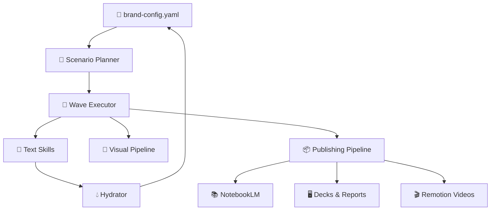

<div align="center">


</div>

<!-- readme-gen:start:badges -->
<p align="center">
  <a href="https://pypi.org/project/brandmint/"></a>
  <a href="./pyproject.toml"></a>
  <a href="https://github.com/Sheshiyer/brandmint-oracle-aleph/releases/latest"></a>
  <a href="./.github/RELEASE_NOTES.md"></a>
  <a href="https://brandmint-openclaw.vercel.app"></a>
  <a href="https://github.com/Sheshiyer/brandmint-oracle-aleph/pkgs/container/brandmint"></a>
</p>
<!-- readme-gen:end:badges -->

<!-- readme-gen:start:tech-stack -->
<p align="center">
  
</p>
<!-- readme-gen:end:tech-stack -->

> Build complete brand systems from one config file.
> **Brandmint** orchestrates strategy, messaging, visual assets, campaigns, and publishing deliverables through a wave-based pipeline.


## Why Brandmint

- **Pipeline-first execution**: run the full chain with `bm launch` instead of ad-hoc skill runs.
- **45 specialized skills / 9 categories**: from buyer persona and positioning to visual generation and publishing.
- **Publishing built in (Wave 7)**: notebook artifacts, decks, reports, diagrams, and Remotion videos.
- **Agent-friendly**: non-interactive mode for CI/desktop/API contexts.
- **OpenClaw integration**: documentation and orchestration flows are aligned for OpenClaw-powered agent setups.

## Quick Start

```bash
# 1) clone
git clone https://github.com/Sheshiyer/brandmint-oracle-aleph.git
cd brandmint-oracle-aleph

# 2) install (editable)
pip install -e .

# 3) initialize config
bm init --output ./my-brand/brand-config.yaml

# 4) run full non-interactive pipeline
bm launch --config ./my-brand/brand-config.yaml \
  --scenario brand-genesis \
  --waves 1-7 \
  --non-interactive
```

## GitHub Package (Container)

Brandmint is now configured to publish a container package to GitHub Container Registry (GHCR).

```bash
docker pull ghcr.io/sheshiyer/brandmint:latest
docker run --rm ghcr.io/sheshiyer/brandmint:latest --help
```

Publishing is automated via GitHub Actions on release publish (`.github/workflows/publish-ghcr.yml`).

## Core CLI Commands

```bash
bm launch     # end-to-end pipeline (waves)
bm plan       # scenario context/recommend/compare
bm visual     # visual generation pipeline
bm publish    # notebooklm, decks, reports, diagrams, video
bm report     # markdown/json/html execution reports
bm cache      # cache stats / clear
```

## Wave Model

| Wave | Focus | Typical Outputs |
|---|---|---|
| 1 | Foundation | persona, competitors, niche inputs |
| 2 | Strategy | positioning, voice, messaging |
| 3 | Visual identity | core visual system + identity assets |
| 4 | Product/campaign | product narratives + campaign copy/assets |
| 5 | Launch assets | email and campaign collateral |
| 6 | Distribution | ads, social, outreach content |
| 7 | Publishing | themes, NotebookLM, decks, reports, diagrams, videos |

## Publishing Deliverables (`bm publish`)

| Command | Output |
|---|---|
| `bm publish notebooklm --config <brand-config.yaml>` | Notebook + artifacts |
| `bm publish decks --config <brand-config.yaml>` | PDF slide decks |
| `bm publish reports --config <brand-config.yaml>` | PDF reports |
| `bm publish diagrams --config <brand-config.yaml>` | Mind maps + Mermaid diagrams |
| `bm publish video --config <brand-config.yaml>` | MP4 videos (brand-sizzle, product-showcase, audio-slides) |

<!-- readme-gen:start:architecture -->
## Architecture (high level)


<!-- readme-gen:end:architecture -->

## Skills Inventory (repo reality)

| Category | Skills |
|---|---:|
| text-strategy | 7 |
| visual-prompters | 9 |
| campaign-copy | 6 |
| email-sequences | 3 |
| brand-foundation | 3 |
| social-growth | 5 |
| advertising | 5 |
| visual-pipeline | 4 |
| publishing | 3 |
| **Total** | **45** |

## Release Highlights (from all repo releases)

- **v4.0.0** — UX, resilience, logging/caching/reporting foundations, budget gates, resume support.
- **v4.1.0** *(published)* — robust `--non-interactive` pipeline behavior, publishing + wiki pipeline, visual asset integration fixes.
- **v4.2.0** *(published)* — Remotion video generation (Wave 7F), full Wave 7 publishing flow hardening, optional `brandmint[video]` extras.
- **v4.2.1** *(current)* — README/metadata alignment: release-aware badges, corrected inventory counts, and changelog initialization.

See: [GitHub Releases](https://github.com/Sheshiyer/brandmint-oracle-aleph/releases) and [repo release notes](./.github/RELEASE_NOTES.md).

<!-- readme-gen:start:health -->
## Project Health Snapshot

| Category | Signal |
|---|---|
| Tests | `tests/test_hydrator.py` present |
| CI/CD | No `.github/workflows` detected in this repo snapshot |
| Packaging | `pyproject.toml` + console scripts (`brandmint`, `bm`) |
| Docs | `README.md`, `CLAUDE.md`, `.github/RELEASE_NOTES.md`, `docs/` |
| State/Reports | execution state + report pipeline implemented |
<!-- readme-gen:end:health -->

## OpenClaw Integration

Brandmint supports OpenClaw-oriented workflows and docs publication paths.

- OpenClaw docs/site touchpoint: [brandmint-openclaw.vercel.app](https://brandmint-openclaw.vercel.app)
- Use the same pipeline-first contract (`bm launch --non-interactive`) for reliable agent orchestration.

## Notes for Agent/CI execution

If you're using an agent environment, follow the pipeline contract in [CLAUDE.md](./CLAUDE.md):

- Prefer `bm launch --non-interactive`
- Avoid running individual skills out of orchestration order
- Use `.brandmint/prompts/` + `.brandmint/outputs/` handoff model for text skills

## License

No `LICENSE` file is currently present in the repository root. Add one before public distribution.

<!-- readme-gen:start:footer -->
<div align="center">


Built with Craft Agent support · powered by wave orchestration

</div>
<!-- readme-gen:end:footer -->
