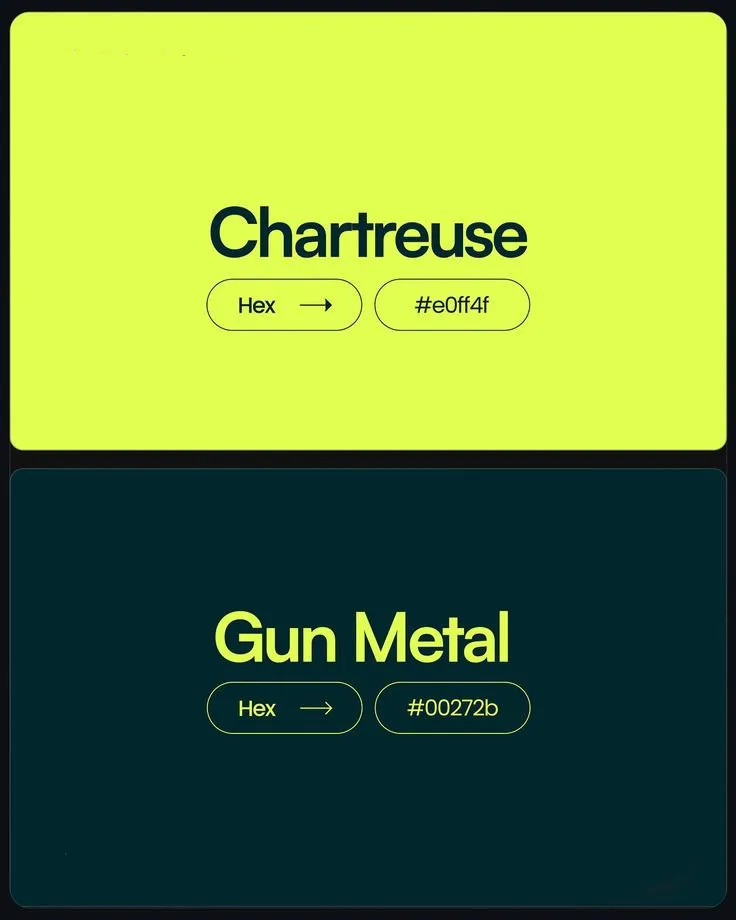
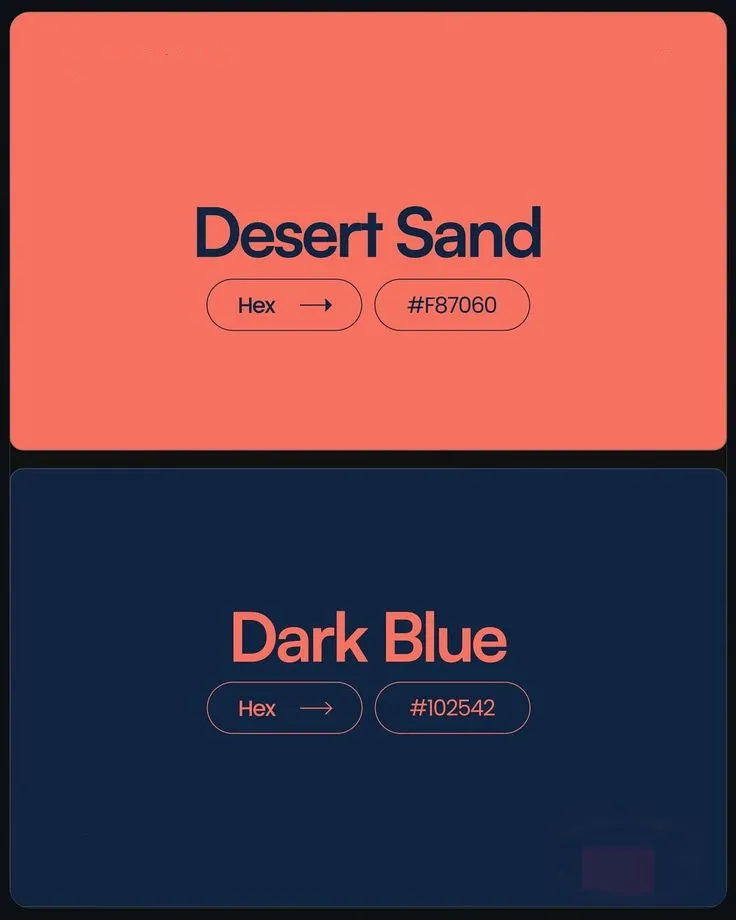
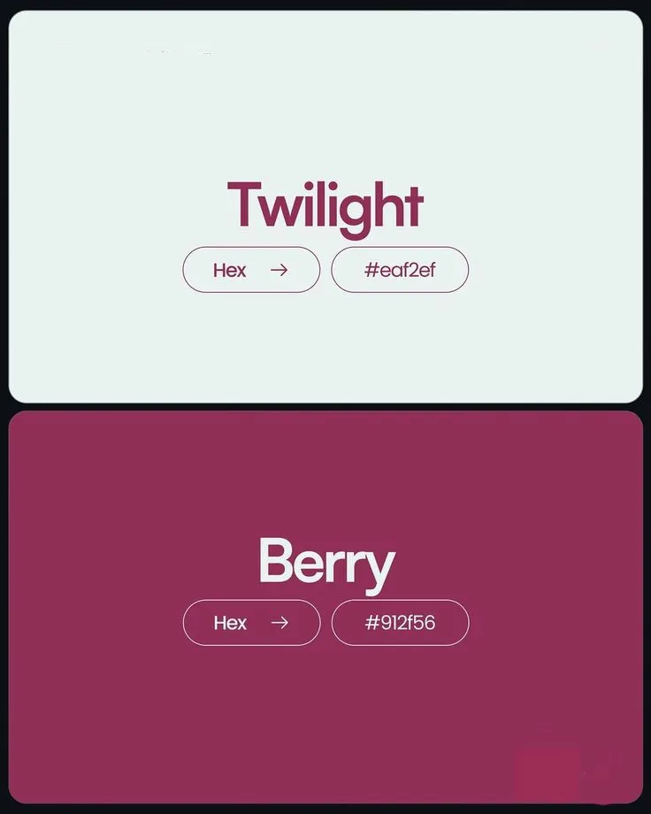
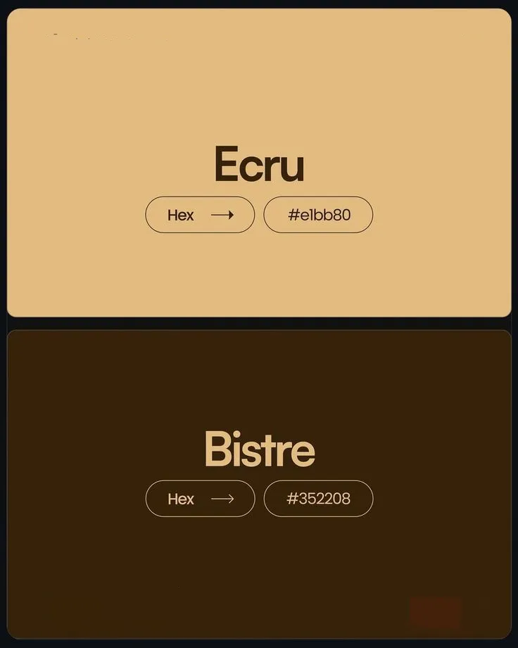
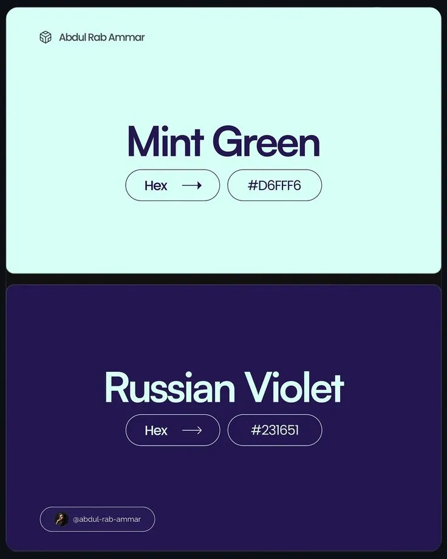
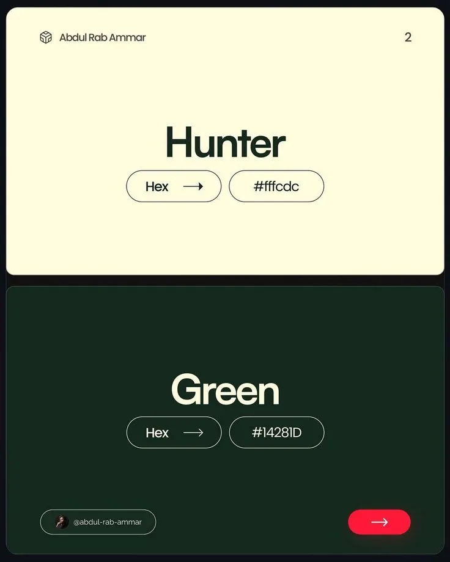
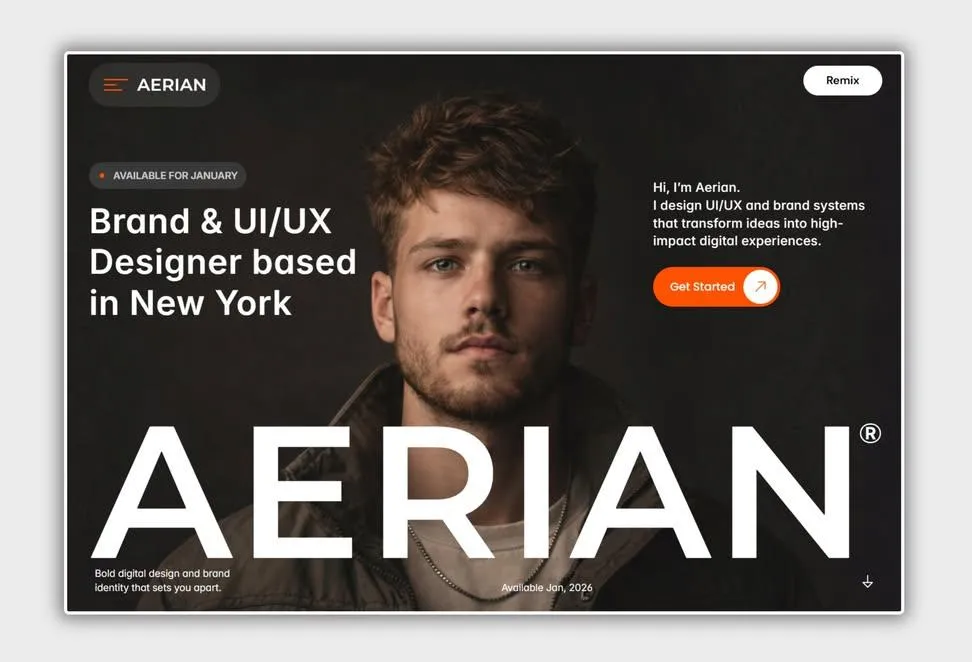
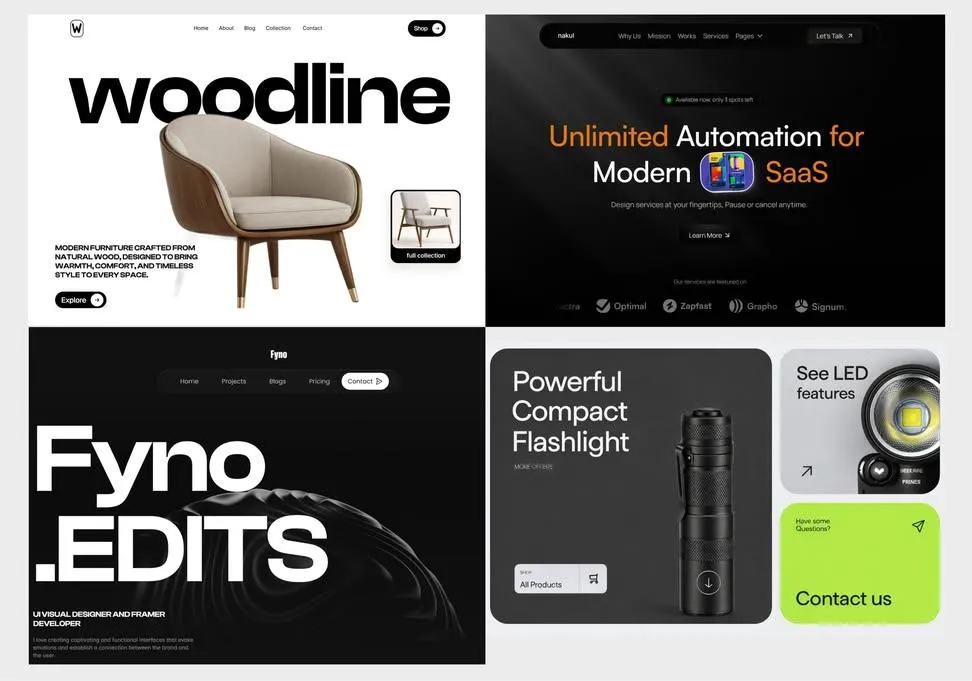

# Color & Typography Reference

## Color Pairs (Full Detail)

### 1. Chartreuse & Gun Metal
- **Chartreuse:** #E0FF4F — Electric yellow-green, high energy
- **Gun Metal:** #00272B — Near-black teal, technical depth
- **Mood:** High-contrast, electric, technical
- **Best for:** High-alert states, action-oriented interfaces, tech dashboards
- **60-30-10:** Gun Metal (60%) + Chartreuse (30%) + White accent (10%)

### 2. Desert Sand & Dark Blue
- **Desert Sand:** #F87060 — Warm coral-salmon
- **Dark Blue:** #102542 — Deep navy
- **Mood:** Modern, warm vs cold tension, sophisticated
- **Best for:** Portfolio sites, creative agencies, warm-cold contrast designs
- **60-30-10:** Dark Blue (60%) + Desert Sand (30%) + Light neutral accent (10%)

### 3. Twilight & Berry
- **Twilight:** #EAF2EF — Misty sage-white
- **Berry:** #912F56 — Deep wine-raspberry
- **Mood:** Elegant, soft, luxurious
- **Best for:** Beauty brands, wellness, luxury retail, premium services
- **60-30-10:** Twilight (60%) + Berry (30%) + Gold or cream accent (10%)

### 4. Ecru & Bistre
- **Ecru:** #E1BB80 — Warm golden tan
- **Bistre:** #352208 — Deep chocolate brown
- **Mood:** Organic, earthy, premium
- **Best for:** Artisan brands, coffee/food, natural products, grounded identity
- **60-30-10:** Ecru (60%) + Bistre (30%) + Cream accent (10%)

### 5. Mint Green & Russian Violet
- **Mint Green:** #D6FFF6 — Cool clinical mint
- **Russian Violet:** #231651 — Deep encrypted purple
- **Mood:** Cyber-clinical, clean, high-density
- **Best for:** Fintech, security products, clinical/medical, encrypted/private interfaces
- **60-30-10:** Russian Violet (60%) + Mint Green (30%) + White accent (10%)

### 6. Cream & Hunter Green
- **Cream:** #FFFCDC — Warm off-white
- **Hunter Green:** #14281D — Deep forest green
- **Mood:** Natural, classic, grounded
- **Best for:** Sustainability brands, outdoor, heritage brands, restaurants
- **60-30-10:** Cream (60%) + Hunter Green (30%) + Warm brown accent (10%)

---

## The 60-30-10 Rule

The foundational color distribution for any interface:

- **60% — Dominant:** Background, large surfaces. Sets the overall mood.
- **30% — Secondary:** Supporting elements, navigation, cards. Creates contrast.
- **10% — Accent:** CTAs, highlights, links, active states. Draws attention.

### Applying with Realtime Colors
1. Go to realtimecolors.com
2. Set your 60% color as "Background"
3. Set your 30% color as "Primary"
4. Set your 10% color as "Accent"
5. Preview on the real site layout
6. Check contrast ratios (green checkmark = passes)
7. Export as CSS, SCSS, PNG, or QR code

---

## Typeface Reference

### Geometric Sans-Serifs

**Euclid** (Swiss Typefaces)
Named after the Greek mathematician. Five collections: Flex, Circular A, Circular B, Square, Triangle. Timeless construction with distinctive flavor per collection. Founded 2006, Swiss International Style legacy.

**Rund** (Letters from Sweden)
Contemporary geometric sans by Goran Soderstrom (2021). Inspired by Neuzeit Grotesk, Futura, Avenir. Foundry clients include Acne Studios, Gucci, The Nobel Prize.

**Cosmica** (Labor & Wait)
Inspired by Erbar-Grotesk (1926), Futura (1927), Nobel (1929). Horizontally cut stroke terminals. Broad weight range with tabular/proportional numerals and true small caps.

### Neo-Grotesque Sans-Serifs

**Nouvelle Grotesk** (Nouvelle Noire)
Distinctive take on Swiss grotesque legacy, seven decades after originals. Simple yet inspiring shapes. Zurich-based, forward-thinking type design.

**Basis Grotesque** (Colophon Foundry)
Originated 2012 as bespoke typeface for Hotshoe magazine. Five weight variations with italics plus monospaced rendition. London-based foundry serving Instagram, Google.

**Formale Grotesque** (Binnenland)
Modern sans with 1930s roots. Blends geometric shapes with dynamic forms. Hand-drawn drafts bridge digital precision with intuitive artistry. Bern, Switzerland.

### Precision Sans-Serifs

**LL Akkurat** (Lineto)
Launched 2004 by Laurenz Brunner. Revisits neo-modernism. Expanded to Cyrillic, Greek, Hebrew, Arabic, Devanagari, Vietnamese. Swiss pioneer in online font distribution (since 1993).

**Sprig Sans** (Faire Type)
Versatile sans-serif with friendly personality. 8 weights (hairline to super) with italics. Available as variable font. Part of larger family (Sprig serif + Sprig Sans Mono). Brooklyn-based.

### Display Serifs

**Roslindale** (DJR)
Text and display serif inspired by De Vinne (19th century). Smooths out clunkiness, dials up contrast. David Jonathan Ross, Western Massachusetts.

**GT Alpina** (Grilli Type)
Redefines "workhorse" serif. 70 styles combining artistic flair with utility. Revives historically expressive shapes. Founded 2009, Switzerland.

---

## Mood-to-Pair Quick Reference

| Project Mood | Recommended Pair | Why |
|-------------|-----------------|-----|
| Technical / Dashboard | Chartreuse & Gun Metal | Electric contrast reads well on dark interfaces |
| Luxury / Premium | Twilight & Berry | Soft elegance with depth |
| Creative / Portfolio | Desert Sand & Dark Blue | Warm-cold tension, modern |
| Organic / Natural | Ecru & Bistre or Cream & Hunter Green | Earthy, grounded |
| Clinical / Fintech | Mint Green & Russian Violet | Clean, encrypted feel |
| Heritage / Classic | Cream & Hunter Green | Timeless, natural |

---

## Visual Examples

### Color Pair Swatches

### Related Design Drops

